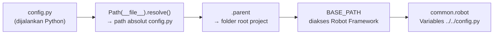

# ⚙️ Standarisasi `config.py`

## 1. Peran & Fungsi

`config.py` adalah **file konfigurasi pusat** yang bertanggung jawab untuk:
- Menentukan **`BASE_PATH`** secara dinamis berdasarkan lokasi project
- Menyediakan variabel path yang diakses oleh Robot Framework via `Variables` import
- Memastikan project **portabel** dan bisa dijalankan di device/komputer manapun

> **Lokasi**: Root project (`config.py`)

---

## 2. Kode Standar Saat Ini

```python
from pathlib import Path

# Path(__file__) adalah path ke file config.py ini.
# .resolve() memastikan kita mendapatkan path absolut (lengkap).
CURRENT_FILE_PATH = Path(__file__).resolve()

# BASE_PATH akan berisi folder tempat file config.py ini berada.
# Jika config.py ada di root project, maka ini adalah root-nya.
BASE_PATH = CURRENT_FILE_PATH.parent
```

---

## 3. Evolusi Arsitektur

### ❌ Pendekatan Lama (Hardcode — Tidak Dipakai Lagi)
```python
# import os
# import socket

# hostname = socket.gethostname()
# if hostname == "DESKTOP-4N88NFD":
#     BASE_PATH = "E:/KERJA RIO/RND"
# else:
#     BASE_PATH = "D:/RND/ROBOT-MOBILE"
```

**Masalah**: Setiap device baru harus ditambahkan manual ke kondisi `if-else`.

### ✅ Pendekatan Sekarang (Dinamis)
```python
from pathlib import Path
CURRENT_FILE_PATH = Path(__file__).resolve()
BASE_PATH = CURRENT_FILE_PATH.parent
```

**Keunggulan**: Otomatis resolve ke folder project, tidak perlu konfigurasi per-device.

---

## 4. Cara Kerja



### Alur Detail
1. Robot Framework menemukan `Variables ../../config.py` di `common.robot`
2. Python mengeksekusi `config.py`
3. `Path(__file__).resolve()` → path absolut ke `config.py` (contoh: `E:/project/config.py`)
4. `.parent` → folder parent (contoh: `E:/project`)
5. `BASE_PATH` tersedia sebagai variabel Robot Framework `${BASE_PATH}`

---

## 5. Aturan Penulisan

### ✅ DO (Lakukan)
| Aturan | Penjelasan |
|--------|------------|
| Gunakan `pathlib.Path` | Modul modern Python untuk manipulasi path |
| Gunakan `__file__` | Agar path selalu relatif terhadap lokasi file |
| Gunakan `.resolve()` | Untuk mendapatkan path absolut yang clean |
| Variabel **UPPER_SNAKE_CASE** | Agar dikenali Robot Framework sebagai variabel global |
| Tambahkan komentar berbahasa Indonesia | Sesuai konvensi tim |

### ❌ DON'T (Hindari)
| Aturan | Penjelasan |
|--------|------------|
| Jangan hardcode path | Contoh: `BASE_PATH = "E:/KERJA RIO/..."` |
| Jangan pakai `socket.gethostname()` | Tidak scalable untuk multi-device |
| Jangan pakai `os.path` jika bisa `pathlib` | `pathlib` lebih modern dan readable |
| Jangan definisikan variabel non-path di sini | `config.py` khusus untuk konfigurasi path |

---

## 6. Cara Extend: Menambah Path Baru

Jika butuh path tambahan (misal: folder screenshot custom, folder driver):

```python
from pathlib import Path

CURRENT_FILE_PATH = Path(__file__).resolve()
BASE_PATH = CURRENT_FILE_PATH.parent

# --- Path Tambahan ---
APP_PATH = BASE_PATH / "apk" / "saucelabs.apk"
RESULTS_PATH = BASE_PATH / "results"
SCREENSHOT_PATH = RESULTS_PATH / "screenshots"
```

> **Catatan**: Saat ini path `APP_PATH`, `JSON_PATH`, dll. didefinisikan di `common.robot` (bukan di `config.py`). Kedua pendekatan valid, namun **konsistensi** adalah kuncinya — pilih salah satu dan terapkan di seluruh project.

---

## 7. Integrasi dengan Robot Framework

### Di `common.robot`:
```robot
*** Settings ***
Variables    ../../config.py

*** Variables ***
# Menggunakan BASE_PATH dari config.py
${APP_PATH}       ${BASE_PATH}/apk/saucelabs.apk
${JSON_PATH}      ${BASE_PATH}/resources/dataFiles/users.json
```

### Aturan Path di Robot Framework:
- Selalu gunakan **forward slash** (`/`) meskipun di Windows
- `${BASE_PATH}` menghasilkan object `Path` — Robot Framework otomatis convert ke string saat digunakan
- Relative path dari `config.py` ke `common.robot` harus konsisten: `../../config.py`

---

## 8. Checklist Validasi

Sebelum push perubahan di `config.py`, pastikan:

- [ ] `BASE_PATH` mengarah ke root project (tempat `config.py` berada)
- [ ] Tidak ada hardcode path ke drive/folder spesifik
- [ ] Semua variabel menggunakan `UPPER_SNAKE_CASE`
- [ ] Import hanya menggunakan `pathlib.Path` (bukan `os.path`)
- [ ] Komentar ditulis dalam Bahasa Indonesia
- [ ] File bisa dieksekusi standalone tanpa error: `python config.py`
